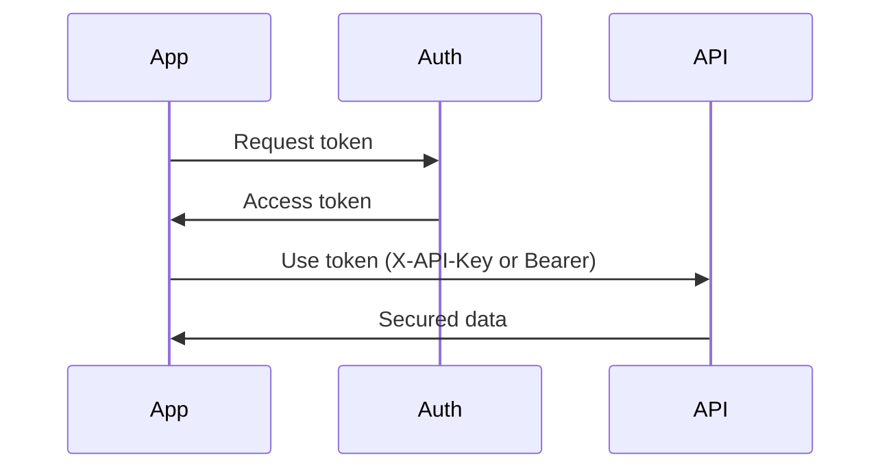

## Overview

Neuro Grid provides multiple authentication methods to secure access to its APIs and dashboard. You choose API keys for simple server-to-server integrations or OAuth 2.0 for user-facing applications like the citizen app. All methods enforce role-based access control (RBAC) to ensure operators manage city data while citizens view public insights only.

<Callout kind="info">
  Generate your credentials from the [Neuro Grid dashboard](https://dashboard.example.com/settings/api).
</Callout>

## Authentication Methods

Use the method that fits your integration needs.

<Tabs>
  <Tab title="API Keys" icon="key">
    API keys offer stateless authentication ideal for backend services monitoring traffic or alerts.

    ## Generate an API Key

    Follow these steps to create a key:

    <Steps>
      <Step title="Log In" icon="log-in">
        Access the dashboard at `https://dashboard.example.com` and navigate to **Settings > API Keys**.
      </Step>
      <Step title="Create Key" icon="plus">
        Click **Generate New Key**, select scopes like `traffic:read` or `alerts:write`, and copy the key.
      </Step>
      <Step title="Assign Role" icon="users">
        Link the key to a user role such as Operator or Citizen.
      </Step>
    </Steps>

    <ParamField header="X-API-Key" param-type="string" required="true">
      Your generated API key. Prefix with `ng_` for Neuro Grid format: `ng_YOUR_API_KEY`.
    </ParamField>

    <CodeGroup tabs="JavaScript,cURL">
      ```javascript
      const response = await fetch('https://api.example.com/v1/traffic', {
        headers: {
          'X-API-Key': 'ng_YOUR_API_KEY',
          'Content-Type': 'application/json'
        }
      });
      const data = await response.json();
      ```
      ```bash
      curl -H "X-API-Key: ng_YOUR_API_KEY" \
           -H "Content-Type: application/json" \
           https://api.example.com/v1/traffic
      ```
    </CodeGroup>
  </Tab>

  <Tab title="OAuth 2.0" icon="shield">
    OAuth enables secure third-party access for apps like citizen dashboards.

    <ParamField query="client_id" param-type="string" required="true">
      Your OAuth client ID from the dashboard.
    </ParamField>

    <ParamField query="redirect_uri" param-type="string" required="true">
      Authorized callback URL, e.g., `https://yourapp.com/callback`.
    </ParamField>

    Authorize users via the OAuth flow:

    ```
    https://auth.example.com/oauth/authorize?client_id=YOUR_CLIENT_ID&redirect_uri=YOUR_URI&scope=traffic:read&response_type=code
    ```

    <Request tabs="JavaScript,Python">
      ```javascript
      const token = await fetch('https://auth.example.com/oauth/token', {
        method: 'POST',
        headers: { 'Content-Type': 'application/json' },
        body: JSON.stringify({
          grant_type: 'authorization_code',
          code: 'AUTH_CODE',
          client_id: 'YOUR_CLIENT_ID',
          client_secret: 'YOUR_CLIENT_SECRET',
          redirect_uri: 'https://yourapp.com/callback'
        })
      }).then(r => r.json());
      ```
      ```python
      import requests
      data = {
        'grant_type': 'authorization_code',
        'code': 'AUTH_CODE',
        'client_id': 'YOUR_CLIENT_ID',
        'client_secret': 'YOUR_CLIENT_SECRET',
        'redirect_uri': 'https://yourapp.com/callback'
      }
      response = requests.post('https://auth.example.com/oauth/token', json=data)
      ```
    </Request>
  </Tab>
</Tabs>

## User Roles and Permissions

Neuro Grid uses RBAC to control data access. Assign roles during key generation or user setup.

<Columns cols={2}>
  <Card title="Operator" icon="shield" href="/docs/roles#operator">
    Full access to traffic monitoring, alerts, and AI insights. Can write congestion reroutes.
  </Card>
  <Card title="Citizen" icon="users" href="/docs/roles#citizen">
    Read-only public data like live traffic heat maps and low-congestion alerts.
  </Card>
  <Card title="Admin" icon="settings" href="/docs/roles#admin">
    Manage users, keys, and platform settings.
  </Card>
  <Card title="Viewer" icon="eye" href="/docs/roles#viewer">
    Dashboard read access without API capabilities.
  </Card>
</Columns>

## Secure Data Access for Citizen App

Citizens access public endpoints via app tokens. Use scopes like `public:traffic` to limit exposure.

<Response tabs="200,401">
  ```json
  {
    "status": "success",
    "data": {
      "congestion": "low",
      "zone": "C",
      "timestamp": "2024-10-15T12:00:00Z"
    }
  }
  ```
  ```json
  {
    "error": "Unauthorized",
    "message": "Invalid or expired token"
  }
  ```
</Response>

<Callout kind="alert">
  Rotate API keys every 90 days. Never commit keys to code repositories. Use environment variables like `{NG_API_KEY}`.
</Callout>

## Advanced Permissions

<Expandable title="Custom Scopes" default-open="false">

Define granular permissions:

| Scope          | Description                  | Role     |
|----------------|------------------------------|----------|
| `traffic:read` | View live feeds             | All     |
| `alerts:write` | Send operator alerts        | Operator |
| `ai:execute`   | Run AI copilot inferences   | Admin   |

</Expandable>

