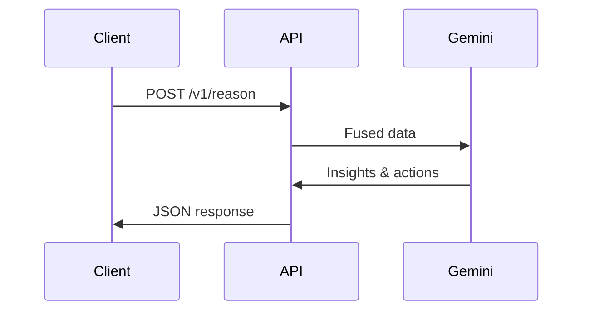

## Overview

Neuro Grid transforms raw city data into actionable intelligence through a layered architecture. You fuse live sensor feeds, computer vision outputs, and AI reasoning to monitor zones, detect issues, and recommend actions. This page covers the core concepts: data fusion, AI reasoning with Gemini, zone-based monitoring, and privacy-focused real-time processing.

<Callout kind="info">
  These concepts form the backbone of Neuro Grid. Master them to build effective monitoring pipelines.
</Callout>

## Core Concepts

Explore the foundational building blocks visually.

<Columns cols={2}>
  <Card title="Data Fusion" icon="database" href="#data-fusion">
    Combine sensor telemetry and computer vision results into unified city state.
  </Card>
  <Card title="AI Reasoning" icon="zap" href="#ai-reasoning">
    Leverage Gemini for context-aware insights and action recommendations.
  </Card>
  <Card title="Zone Monitoring" icon="map" href="#zone-monitoring">
    Divide cities into zones for granular heat mapping and alerts.
  </Card>
  <Card title="Privacy Principles" icon="shield" href="#privacy">
    Ensure compliant, real-time processing without compromising user data.
  </Card>
</Columns>

## Data Fusion

Neuro Grid fuses multiple data sources for a complete city view. Sensors provide telemetry like traffic counts, while computer vision from YOLO detects vehicles and congestion.

Use the API to stream fused data:

<CodeGroup tabs="JavaScript,Python">
  ```javascript
  const ws = new WebSocket('wss://api.example.com/v1/stream/fused-data');
  ws.onmessage = (event) => {
    const data = JSON.parse(event.data);
    console.log('Fused state:', data.zones);
  };
  ```
  ```python
  import websocket
  import json

  def on_message(ws, message):
      data = json.loads(message)
      print('Fused state:', data['zones'])

  ws = websocket.WebSocketApp('wss://api.example.com/v1/stream/fused-data',
                              on_message=on_message)
  ws.run_forever()
  ```
</CodeGroup>

<Expandable title="Advanced Fusion Pipeline" default-open="false">
  The pipeline processes `<100ms` latency: ingest → normalize → fuse → emit.
</Expandable>

## AI Reasoning Engine

Integrate Google Gemini for explainable AI. Send fused data to generate ranked actions.



Example request parameters:

<ParamField path="zones" param-type="array" required="true">
  Array of zone states from fusion.
</ParamField>

<ParamField body="context" param-type="string" required="false">
  Optional city-specific context like events or weather.
</ParamField>

## Zone-Based Monitoring

Divide your city into zones for targeted analysis. Each zone tracks metrics like congestion levels.

| Zone ID | Type     | Metrics                  | Heat Map Color |
|---------|----------|--------------------------|----------------|
| zone-1 | Highway | Vehicles >50, Density high | Red           |
| zone-2 | Urban   | Congestion low          | Green         |
| zone-3 | Arterial| Alerts active           | Yellow        |

Monitor via WebSocket for real-time updates.

<Tabs>
  <Tab title="JavaScript" icon="code">
    ```javascript
    const zones = await fetch('https://api.example.com/v1/zones');
    const heatMap = zones.json().then(data => renderHeatMap(data));
    ```
  </Tab>
  <Tab title="Python" icon="python">
    ```python
    import requests
    response = requests.get('https://api.example.com/v1/zones')
    zones_data = response.json()
    # Render heat map
    ```
  </Tab>
</Tabs>

## Privacy and Real-Time Processing

Neuro Grid prioritizes privacy with edge processing and anonymization. You process video feeds locally, extracting metadata without storing raw frames. Real-time guarantees come from WebSocket streams and `<200ms` inference.

<Callout kind="tip">
  Always enable `anonymize=true` in your config to comply with regulations.
</Callout>

<Steps>
  <Step title="Setup Zones" icon="map">
    Define zones via dashboard at `https://dashboard.example.com/zones`.
  </Step>
  <Step title="Fuse Data" icon="database">
    Connect sensors and cameras to `/v1/fuse`.
  </Step>
  <Step title="Enable AI" icon="zap">
    Activate Gemini integration in settings.
  </Step>
</Steps>

## Next Steps

Build your first pipeline using these concepts. Check the [Quickstart](/quickstart) for hands-on setup.