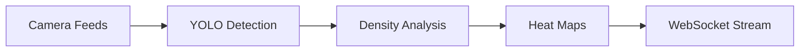

## Overview

Neuro Grid delivers intelligence at every layer of city operations. You gain real-time insights from fused data sources, including computer vision and sensors. Key features include traffic monitoring with YOLO detection, an AI copilot for recommendations, interactive 3D digital twin visualizations, and tools for smart parking and sanitation.

These capabilities help operators respond faster, reduce congestion, and optimize resources. Start by exploring the features below.

<Columns cols={2}>
  <Card title="Real-Time Traffic Intelligence" icon="zap" href="#traffic-intelligence">
    Process live camera feeds with YOLO to detect vehicles and congestion in `<200ms`.
  </Card>
  <Card title="AI Copilot" icon="cpu" href="#ai-copilot">
    Get ranked action recommendations with explainable AI from Google Gemini.
  </Card>
  <Card title="Interactive Digital Twin" icon="globe" href="#digital-twin">
    Visualize city state in 3D with live data overlays and simulations.
  </Card>
  <Card title="Smart Parking & Sanitation" icon="settings" href="#smart-tools">
    Monitor availability and waste levels to streamline urban services.
  </Card>
</Columns>

## Real-Time Traffic Intelligence

Monitor traffic across zones using YOLO-based computer vision. Neuro Grid classifies vehicles, measures density, and generates heat maps via WebSocket streams.

Connect to the real-time API to receive updates.

<CodeGroup tabs="JavaScript,Python">
  ```javascript
  const ws = new WebSocket('wss://api.example.com/v1/traffic/stream?zone=A');
  ws.onmessage = (event) => {
    const data = JSON.parse(event.data);
    console.log(`Congestion in zone ${data.zone}: ${data.level}%`);
  };
  ```
  ```python
  import websocket
  import json

  def on_message(ws, message):
      data = json.loads(message)
      print(f"Congestion in zone {data['zone']}: {data['level']}%")

  ws = websocket.WebSocketApp("wss://api.example.com/v1/traffic/stream?zone=A",
                              on_message=on_message)
  ws.run_forever()
  ```
</CodeGroup>

<Callout kind="tip">
  Use `ParamField path="zone"` to specify areas like `A`, `B`, or `C`.
</Callout>



## AI Copilot for Action Recommendations

The multi-engine copilot analyzes live city state and suggests actions. Powered by Gemini Pro, it provides rationale, confidence scores, and impact projections.

Query the copilot endpoint with current telemetry.

<Request tabs="JavaScript,cURL" show-lines="true">
  ```javascript
  const response = await fetch('https://api.example.com/v1/copilot/recommend', {
    method: 'POST',
    headers: { 'Authorization': 'Bearer YOUR_TOKEN' },
    body: JSON.stringify({ zone: 'A', congestion: 75 })
  });
  const insights = await response.json();
  ```
  ```bash
  curl -X POST https://api.example.com/v1/copilot/recommend \
    -H "Authorization: Bearer YOUR_TOKEN" \
    -H "Content-Type: application/json" \
    -d '{"zone": "A", "congestion": 75}'
  ```
</Request>

<Response tabs="200">
  ```json
  {
    "recommendations": [
      {
        "action": "Reroute traffic",
        "confidence": 0.92,
        "impact": "Reduce congestion by 30%",
        "rationale": "Zone C patterns match historical peaks."
      }
    ]
  }
  ```
</Response>

## Interactive Digital Twin Visualization

View your city as a 3D digital twin. Overlay live traffic, sensor data, and simulations for scenario planning.

Embed the twin in your dashboard:

<Steps>
  <Step title="Get API Key" icon="key">
    Sign up at `https://dashboard.example.com` to obtain `YOUR_API_KEY`.
  </Step>
  <Step title="Load Twin" icon="globe">
    ```javascript
    const twin = await loadTwin({
      apiKey: 'YOUR_API_KEY',
      city: 'your-city'
    });
    twin.addOverlay('traffic-heatmap');
    ```
  </Step>
  <Step title="Interact" icon="mouse-pointer">
    Click zones to simulate interventions like signal adjustments.
  </Step>
</Steps>

## Smart Parking and Sanitation Management

Manage parking spots and waste bins with IoT sensors. Get availability and fill-level alerts.

<Tabs>
  <Tab title="Parking" icon="car">
    <ParamField query="zone" param-type="string" required="true">
      Parking zone identifier.
    </ParamField>
    ```javascript
    fetch('https://api.example.com/v1/parking/status?zone=P1')
      .then(res => res.json())
      .then(data => console.log(`${data.available} spots free`));
    ```
  </Tab>
  <Tab title="Sanitation" icon="trash">
    <ParamField query="bin_id" param-type="string" required="true">
      Bin identifier.
    </ParamField>
    ```javascript
    fetch('https://api.example.com/v1/sanitation/levels?bin_id=BIN123')
      .then(res => res.json())
      .then(data => console.log(`Fill level: ${data.level}%`));
    ```
  </Tab>
</Tabs>

<Expandable title="Advanced Integration" default-open="false">
  Combine features by subscribing to a unified event stream:

  ```javascript
  const events = new EventSource('https://api.example.com/v1/events?features=all');
  events.onmessage = (e) => {
    const event = JSON.parse(e.data);
    // Handle traffic, parking, sanitation events
  };
  ```
</Expandable>

<Callout kind="success">
  Integrate these features to cut response times by up to 50%. Customize alerts via the dashboard.
</Callout>